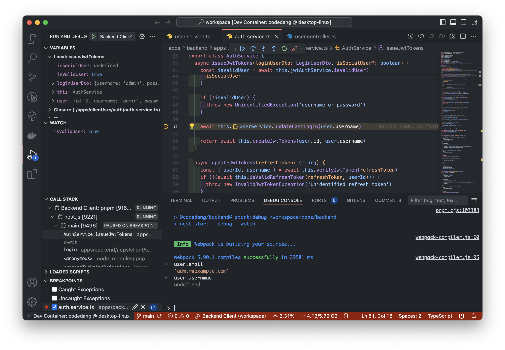

# 백엔드 개발 가이드

[시작하기 가이드](/dev/intro/getting-started.md)를 따라 개발 환경 세팅을 마쳤다면, 아래 명령어로 백엔드 서버를 시작할 수 있어요.

```bash
cd apps/backend
pnpm start:dev
```

백엔드 개발은 다음과 같은 순서로 이루어져요.

1. 코드 작성
2. Bruno로 API 테스트
3. Unit test 코드 작성
4. Bruno로 API 문서화

## 백엔드 서버 구조

백엔드 서버는 다양한 요소로 구성되어있어요.
NestJS를 중심으로 데이터베이스(PostgreSQL), Redis, S3 저장소, 채점 서버 등 다양한 요소로 구성되어 있어요.
각 요소들에 대한 설명은 [Architecture 페이지](/dev/project/architecture.md)에서 확인할 수 있어요.

여기서는 NestJS 기반의 API 서버를 알아볼게요.
백엔드 서버는 크게 **Client와 Admin으로 나뉘어져 있어요.**

- **Client**: 사용자가 사용하는 API 서버 (학생, 일반인 등)
- **Admin**: 관리자가 사용하는 API 서버 (교수님, 조교님, 운영진 등)

### REST API vs GraphQL

Client는 REST API로 구성되어 있고, Admin은 GraphQL로 구성되어 있어요.
Admin에 GraphQL을 사용한 이유는, client는 read 작업 위주인데 비해 admin은 write 작업이 많고, 그만큼 여러 모델이 연관된 복잡한 쿼리가 필요하기 때문이에요.

예시를 들어 자세하게 설명해볼게요.
Client에서 흔한 작업은 '특정 문제의 제출 내역 가져오기', '특정 그룹의 사용자 목록 가져오기' 등의 read 작업이예요.
이 작업들의 응답은 제출(submission) 모델, 사용자(user) 모델 등 한 가지 모델만을 반환하면 되기 때문에 REST API로 충분해요.
반면 admin에서는 '특정 대회의 문제 만들기'와 같은 write 작업이 많아요.
이는 대회(contest) 모델, 문제(problem) 모델, 그리고 테스트케이스(testcase) 모델 등 여러 모델을 연관시켜야 하고 많은 필드를 포함하기 때문에 요청과 응답이 복잡해져요.
이런 경우에 GraphQL은 REST API보다 장점이 많아요.
여러 자동화 도구로 쉽게 쿼리를 만들 수 있고, 프론트엔드에서는 요청과 응답의 타입을 읽을 수 있어 더 빠르고 정확하게 개발할 수 있어요.

GraphQL이 REST API에 비해 배우기 어렵고 서버 구현이 복잡하다는 단점이 있지만, 복잡한 쿼리를 다루는 admin에게는 GraphQL이 더 효율적이에요.

### 공통 모듈

NestJS는 모듈 기반으로 코드를 구성해요.
비슷한 기능끼리 최대한 모듈로 묶어서 관리하지만, 어떤 코드는 여러 모듈에서 공통으로 사용되기도 해요.
그러한 코드와 모듈은 'libs' 디렉토리에 위치해요.

## Bruno 활용하기

이 프로젝트에서는 API 도구로 Bruno를 사용하고 있어요. Bruno는 Postman처럼 API를 테스트하고 문서화하는 오픈 소스 도구예요. [이 글](/dev/tools/bruno.md)을 참고해서 Bruno를 세팅해주세요.

개발 중에는 Bruno로 수시로 API를 테스트하고, 개발이 완료되면 Bruno로 API를 문서화해요.
프론트엔드 개발자를 비롯해서 다른 개발자들이 API를 쉽게 사용할 수 있도록 꼼꼼하게 문서화해주세요!

## 디버깅

코드당 프로젝트에는 Visual Studio Code 전용 디버깅 설정이 있어요.
VSCode 사이드 탭에서 'Run and Debug'를 클릭하고, 원하는 디버깅 모드를 선택한 다음 시작해보세요.



## Database

개발 중에 데이터베이스를 확인하고 수정해야 할 때가 있어요.
코드당 프로젝트에서는 Prisma Studio 사용을 권장하고 있어요.
다음 명령어로 Prisma Studio를 실행할 수 있어요.

```bash
cd apps/backend
pnpm studio
```

<!-- TODO: DataGrip 가이드 추가 -->

## 테스트

테스트는 코드의 안정성을 보장하고, 코드 리팩토링을 쉽게 해주는 중요한 요소에요.
터미널에 다음 명령어를 입력하면 테스트를 실행할 수 있어요.

```bash
cd apps/backend
pnpm test
```

<!-- TODO: Mocha 설명 (왜 Jest를 사용하지 않는지) -->
<!-- TODO: 테스트 작성 규칙 추가 -->
