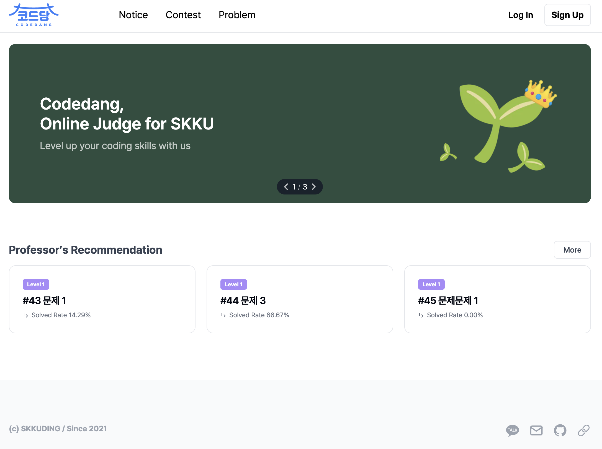
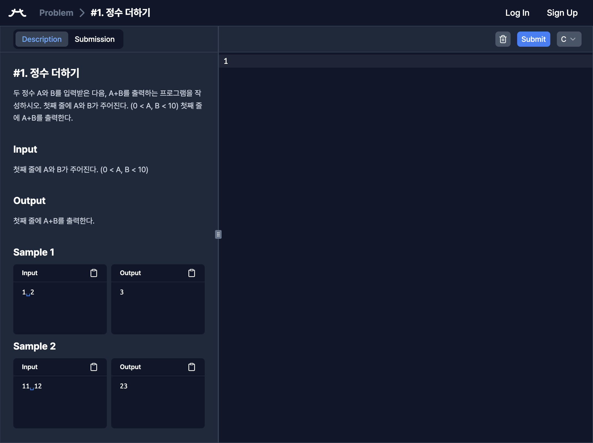
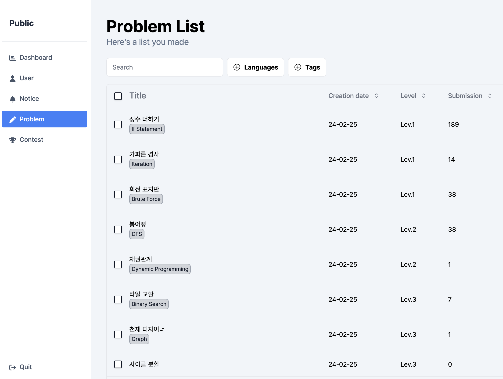

# 폴더 구조

`apps/frontend` 폴더를 열어보면 프로젝트가 여러 폴더로 구성된 걸 볼 수 있어요.

```
apps/frontend
├── app
│   ├── admin
│   ├── (main)
│   └── ...
├── components
│   ├── auth
│   ├── ui
│   └── ...
├── __generated__
│   └── ...
├── graphql
│   └── ...
├── lib
│   └── ...
├── public
│   └── ...
├── stores
│   └── ...
├── __tests__
│   └── ...
├── types
│   └── ...
├── codegen.ts
├── components.json
├── middleware.ts
├── next.config.js
├── package.json
├── postcss.config.js
├── sentry.client.config.ts
├── sentry.edge.config.ts
├── sentry.server.config.ts
├── tailwind.config.ts
├── tsconfig.json
└── vitest.config.ts
```

## Top-level folders

- `app`: Next.js App Router
- `components`: 여러 페이지에서 사용되는 global components
- `__generated__`: GraphQL의 요청/응답 타입. `pnpm compile` 명령어로 자동 생성돼요.
- `graphql`: GraphQL의 query, mutation 모음
- `lib`: 프론트엔트 내에서 사용되는 공유 코드
- `public`: Static assets ([Next.js 문서 참고](https://nextjs.org/docs/app/building-your-application/optimizing/static-assets))
- `stores`: [Zustand](https://zustand-demo.pmnd.rs/) 기반의 상태 저장소
- `__tests__`: 테스트 파일 (unit test, e2e test)
- `types`: 공유되는 타입 모음

## Top-level files

- `.eslintrc.js`: [ESLint](https://eslint.org/) 설정
- `.gitignore`: Git에 포함하지 않을 파일
- `codegen.ts`: [GraphQL-Codegen](https://the-guild.dev/graphql/codegen) 설정
- `components.json`: [shadcn](https://ui.shadcn.com/) 설정
- `middleware.ts`: Next.js middleware ([Next.js 문서 참고](https://nextjs.org/docs/app/building-your-application/routing/middleware))
- `next.config.js`: Next.js 설정
- `package.json`: Node.js 프로젝트 설정
- `postcss.config.js`: PostCSS 설정 (Tailwind CSS가 필요로 함!)
- `sentry.*.config.ts`: [Sentry](https://sentry.io/welcome/) 설정 (모니터링)
- `tailwind.config.ts`: Tailwind CSS 설정
- `tsconfig.json`: TypeScript 설정
- `vitest.config.ts`: [Vitest](https://vitest.dev/) 설정

## `app` folder

코드당은 크게 세 개의 레이아웃으로 구성되어있어요.

|              main               |           problem(contest)            |               admin               |
| :-----------------------------: | :-----------------------------------: | :-------------------------------: |
|  |  |  |

- `main`: `(main)` 폴더
- `problem`: `problem/[problemId]`와 `contest/[contestId]/problem/[problemId]` 폴더
- `admin`: `admin` 폴더

> [!TIP] problem과 contest 폴더의 중복
> 두 폴더 내에 중복되는 내용이 많아, `(code)`와 같은 이름의 폴더를 새로 생성하고 중복을 없애는 방안을 고려 중이에요.

이 외에는 다음과 같은 폴더들이 있어요.

- `next-auth`: Next.js의 인증 라이브러리인 [NextAuth.js](https://next-auth.js.org/)가 사용하는 폴더예요.
- `_components`: 해당 페이지 내에서만 사용되는 local 컴포넌트들을 모아뒀어요.

> [!TIP] Route에 포함되지 않는 폴더
>
> - `_`로 시작되는 폴더는 route에 통째로 포함되지 않아요. ([Private Folders](https://nextjs.org/docs/app/building-your-application/routing/colocation#private-folders) 참고)
> - 이름이 괄호 `()`로 이루어진 폴더는 폴더 이름이 URL에 포함되지 않아요. ([Route Groups](https://nextjs.org/docs/app/building-your-application/routing/route-groups) 참고)

## `components` folder

여러 페이지가 공유하는 컴포넌트들을 모아뒀어요. 그 중에서도 어떤 컴포넌트들은 폴더 안에 따로 뒀어요.

- `auth`: 인증 관련 컴포넌트
- `ui`: shadcn이 자동 생성한 컴포넌트
