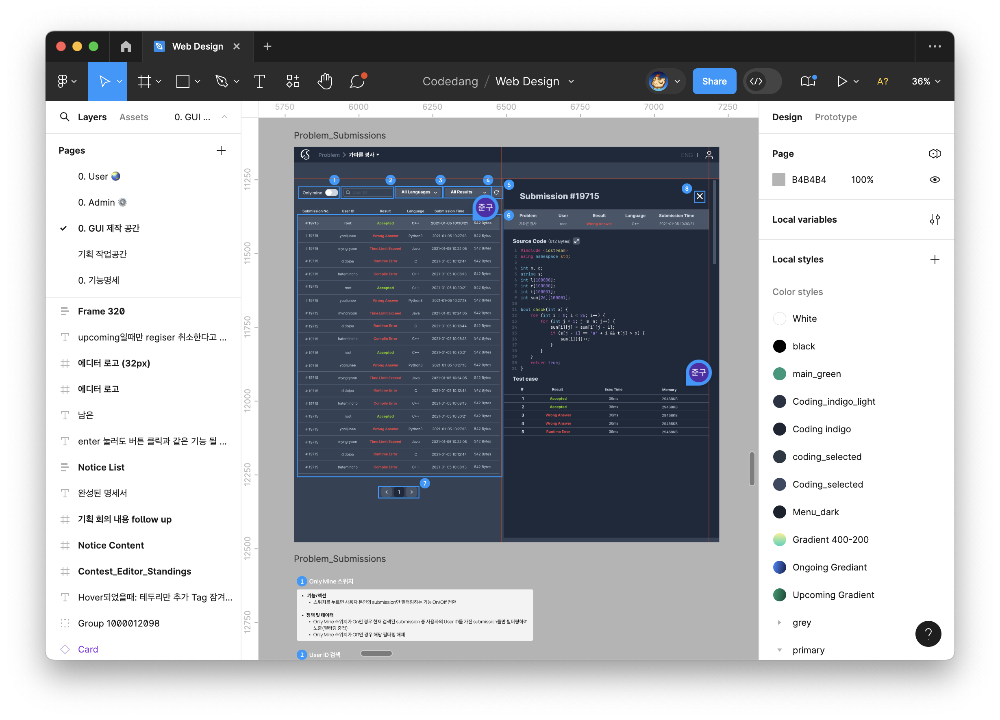

# 프론트엔드 개발 가이드

우선 ['시작하기' 가이드](/dev/intro/getting-started.md)를 따라 개발 환경을 세팅해주세요!
이후에 아래 명령어를 입력해서 개발 서버를 시작할 수 있어요.

```bash
cd apps/frontend
pnpm dev
```

## 프론트엔드 팀이 신경 쓸 것

### 항상 사용자 입장을 생각해주세요!

프론트엔드에서 개발하는 모든 기능은 사용자가 직접 보고 클릭하게 되는 화면이에요.
서버를 비롯한 뒷단 기능이 아무리 화려하게 구현되어있더라도, 화면이 사용자 마음에 들지 않는다면 아무 소용이 없죠.
사용자가 서비스를 좋아하고 더 많이 사용하게 하려면, 모든 디테일을 놓치지 않는 사용자 경험은 필수예요.

예를 들어 API를 호출하는 코드가 있을 때, 에러를 어떻게 다루는 것이 좋을까요?
`console.error`로 출력하면 그만일까요?

```ts
const res = await fetch(baseUrl + `/notice/${id}`)
if (!res.ok) {
  console.error('Request failed')
}
```

뭔가 잘못된 동작이 있다면, 사용자에게 구체적인 메시지를 출력해주는 게 중요하겠죠.
아래처럼 말이예요.

```ts
const res = await fetch(baseUrl + `/notice/${id}`)
if (!res.ok) {
  if (res.status == 401) {
    toast.error('Please log in for access.')
  } else if (res.status == 500) {
    toast.error('Server Error! Try again later.')
  }
}
```

기획 팀이나 디자인 팀 등에서 작성한 요구 사항과 스펙에 모든 디테일까지는 열거하기 어려울 수 있으니까, 생각나는 것이 있다면 자신있게 제안하고 구현해보세요!

### 요구 사항과 스펙을 충분히 이해한 다음 구현해주세요!

UI를 구현하기 때문에 프론트엔드 팀은 어떤 개발팀보다도 기획/디자인 팀과 밀접하게 연관되어 있어요.
전달 받은 요구사항을 정확하게 이해하고, 궁금한 점이나 분명하게 할 것들은 기획/디자인 팀과 충분히 상의하는 게 중요해요.
또 이 기능들을 정확하게 구현하려면, 코드당 서비스에 대한 이해도를 높이는 것도 중요하겠죠?

## Figma

Figma는 디자인 툴로, 기획/디자인 팀에서 UI를 구상하고 스펙을 정리하는 곳이에요.
앞으로 수시로 Figma를 확인하면서 구현할 화면을 참고할 거예요.
아직 Figma를 세팅하지 못했다면, 팀장이나 멘토에게 물어보세요!



## shadcn + Tailwind CSS

코드당 프로젝트는 컴포넌트 라이브러리로 [shadcn](https://ui.shadcn.com/)을 사용하고 있어요.
shadcn은 깔끔한 디자인의 컴포넌트를 제공하면서, Tailwind CSS로 유연한 디자인 수정이 가능해요.
코드당 역시 [Tailwind CSS](https://tailwindcss.com/)로 shadcn 외의 여러 스타일을 관리하고 있어요.

## 백엔드 API 사용

백엔드 API를 호출해서 데이터를 받으려면, 요청하는 형식과 응답 값을 미리 알아야겠죠.
코드당 프로젝트는 Bruno에 백엔드 API를 정리해뒀어요.
Bruno는 Postman처럼 API를 테스트하고 문서화하는 오픈 소스 도구예요.
[이 글](/dev/tools/bruno.md)을 참고해서 Bruno를 세팅해주세요.

## 디버깅

> 세팅 후 내용 추가 예정입니다!
