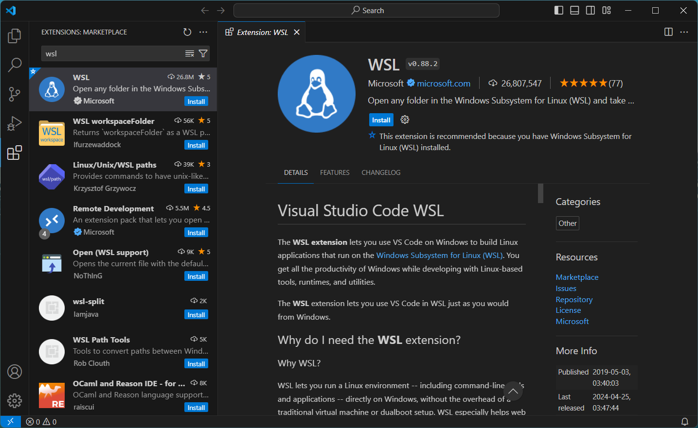
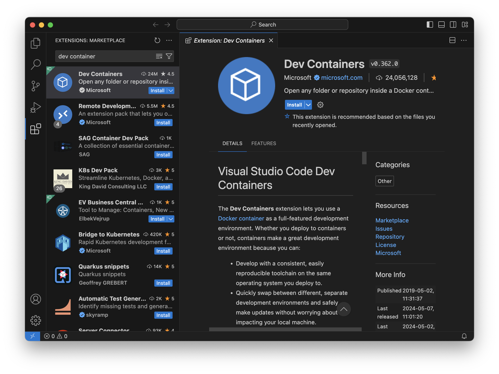
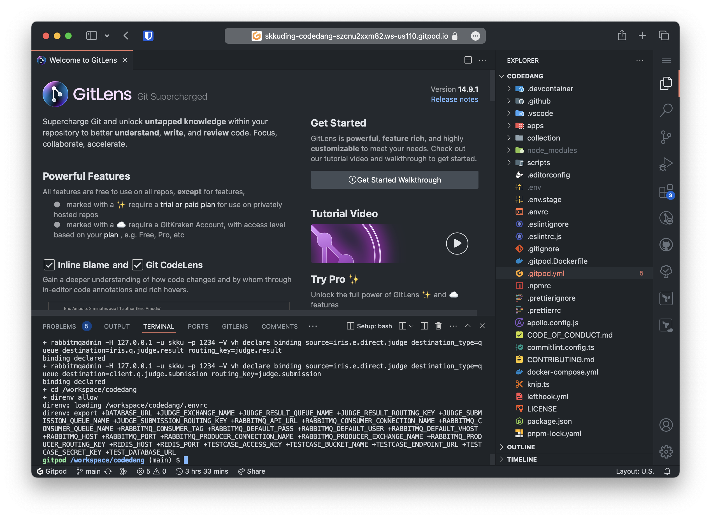

# Getting Started

코드당 개발 환경을 세팅할 수 있는 환경은 크게 세 가지가 있습니다.

1. [**Visual Studio Code**](#visual-studio-code)
2. [**Dev Container (RAM 16GB 이상 권장)**](#dev-container)
3. [**Remote Development (GitHub Codespaces / Gitpod)**](#remote-development)

프론트엔드 개발은 **1번**, 백엔드 개발은 **2번** 환경을 권장해요.

가장 권장하는 개발 환경은 2번 Dev Container이지만, 많은 리소스를 필요로 하고 노트북의 배터리 소모가 빠를 수 있어요.
더 적은 리소스로 쾌적한 개발을 원하는 경우에는 GitHub Codespaces 또는 Gitpod을 이용하는 걸 권장해요.

## Visual Studio Code

### 1. 기본 도구 설치

::: code-group

<div class="vp-block active" data-title="Windows">

- **WSL**: PowerShell 또는 Windows 명령 프롬프트를 마우스 오른쪽 단추로 클릭하고 "관리자 권한으로 실행"을 선택하여 열고 `wsl --install` 명령을 입력한 다음 컴퓨터를 다시 시작해주세요.

- **Git**: WSL 터미널을 열고 [https://git-scm.com/download/linux](https://git-scm.com/download/linux)을 참고하여 설치합니다. 미리 Git이 설치되어 있을 수 있으니 터미널에서 `git --version` 명령어를 입력해 확인해주세요.

<div class="info custom-block">
  <p class="custom-block-title">WSL이 뭔가요?</p>
  <p>Windows Subsystem for Linux(WSL)은 Windows에서 Linux 커널을 실행할 수 있게 해주는 기능입니다. 스꾸딩의 개발 환경은 리눅스에 최적화되어있기 때문에 WSL 사용을 권장해요.</p>
</div>

</div>

<div class="vp-block" data-title="Mac OS">

- **Git**: [https://git-scm.com/download/mac](https://git-scm.com/download/mac)을 참고하여 설치합니다. 미리 Git이 설치되어 있을 수 있으니 터미널에서 `git --version` 명령어를 입력해 확인해주세요.

</div>

<div class="vp-block" data-title="Linux">

- **Git**: [https://git-scm.com/download/linux](https://git-scm.com/download/linux)를 참고하여 설치합니다. 미리 Git이 설치되어 있을 수 있으니 터미널에서 `git --version` 명령어를 입력해 확인해주세요.

</div>

:::

### 2. Visual Studio Code 설치

[Visual Studio Code 홈페이지](https://code.visualstudio.com/)에서 VSCode 설치 파일을 다운로드 받고, 파일을 실행하여 설치합니다.

### 3. WSL 환경 열기 <Badge type="info" text="Windows Only" />

> Windows 환경이 아니라면 이 단계를 건너뛰세요 :fast_forward:

Visual Studio Code를 열고 왼쪽의 'Extensions' icon을 눌러 "WSL"을 검색창에 입력합니다.
WSL 확장을 선택하고 'Install' 버튼을 눌러 설치합니다.



왼쪽 아래의 `><` 모양 아이콘을 누르고 'Connect to WSL in New Window'를 선택하여 WSL 환경에서 VSCode를 시작합니다.

<p align="center">
  
</p>

### 4. Clone Repository

::: warning Windows 사용자라면 WSL 안에 clone해주세요!

Windows file system에 clone 받는 것보다(`/mnt/c`) WSL 내에 clone 받는 것을 권장해요(`~/`).
WSL에서 Windows file system에 접근하면 [파일 저장 이벤트를 인식하지 못하는 문제](https://github.com/microsoft/WSL/issues/4739)를 비롯해 성능 저하 등 여러 문제가 있습니다. 무슨 말인지 모르겠다면 3번 단계처럼 WSL 환경을 열고, 아래 가이드를 따라주세요!

:::

Visual Studio Code를 열고 왼쪽의 'Source Control' icon을 눌러 'Clone Repository' 버튼을 눌러주세요.
GitHub 로그인을 요청한다면 로그인을 해주세요.
이후 'Clone from GitHub'를 선택한 다음 skkuding/codedang을 검색하여 원하는 위치에 clone 받습니다.


::: warning 백엔드 서버를 실행하려면 Dev Container 세팅을 계속해주세요.

백엔드 서버 실행을 위해서는 다른 세팅이 더 필요해요. 다음 단계들을 건너 뛰고, [Dev Container 가이드](#dev-container)를 따라 세팅을 계속해주세요.

:::

### 5. Node.js, pnpm 설치

Node.js 설치를 위해 Node.js 버전 관리 도구인 nvm을 설치해야 해요.
터미널을 열어(단축키 <kbd>Ctrl</kbd> + <kbd>\`</kbd> 또는 <kbd>⌃</kbd> + <kbd>\`</kbd>) 다음 명령어를 입력해주세요.

```sh
curl -o- https://raw.githubusercontent.com/nvm-sh/nvm/master/install.sh | bash
exit
```

이후 터미널을 다시 열고, 다음 명령어를 입력해 Node.js를 설치해주세요.

```sh
nvm install --lts  # Node.js 최신 LTS 버전을 설치합니다.
```

이후 pnpm을 설치해주세요.

```sh
corepack enable  # pnpm을 사용하기 위해 corepack을 활성화합니다.
pnpm i           # 프로젝트에 필요한 패키지를 설치합니다.
```

::: tip 프론트엔드라면 아래 확장들을 설치해주세요!

Dev Container를 사용하지 않는다면 직접 확장 기능을 설치해야 해요. 아래 확장 기능들을 설치해주세요.

- **EditorConfig (필수)**: 코드 스타일을 통일해주는 확장 기능이에요.
- **Prettier (필수)**: 코드 formatting을 자동으로 해주는 확장 기능이에요.
- **ESLint (필수)**: 코드 품질을 검사해주는 확장 기능이에요.
- **Apollo GraphQL (필수)**: GraphQL 자동 완성과 검사를 해주는 확장 기능이에요.
- **GitLens**: Git 관련 기능을 확장해주는 확장 기능이에요.
- **Git History**: Git commit 기록을 쉽게 확인할 수 있는 확장 기능이에요.

:::

### 6. 서버 실행

프론트엔드 서버를 실행하려면 터미널을 열어(단축키 <kbd>Ctrl</kbd> + <kbd>\`</kbd> 또는 <kbd>⌃</kbd> + <kbd>\`</kbd>) 다음 명령어를 입력해주세요.

```sh
cd apps/frontend
pnpm dev
```

이제 브라우저에서 [http://localhost:5525](http://localhost:5525)를 열면 개발 서버를 확인할 수 있어요!

## Dev Container

Dev Container는 Docker 컨테이너 안에서 VSCode 환경을 구축하는 방법입니다. 백엔드 서버 실행에 필요한 데이터베이스, Redis 등을 포함하고 있고, 여러 설정이 자동으로 이루어져 빠르게 개발을 시작할 수 있어요.

**Dev Container 세팅을 시작하기 전, [Visual Studio Code](#visual-studio-code) 세팅의 1~4번을 완료해주세요!**

### 1. Docker 설치

::: code-group

<div class="vp-block active" data-title="Windows">

WSL 설치 이후 [Docker Desktop](https://docs.docker.com/desktop/install/windows-install/)을 설치합니다.

</div>

<div class="vp-block" data-title="Mac OS">

[Docker Desktop](https://docs.docker.com/desktop/install/mac-install/)을 설치합니다.

</div>

<div class="vp-block" data-title="Linux">

터미널에서 다음 명령어를 실행하세요: `curl -fsSL https://get.docker.com | sudo sh`

이후 [Post-installation steps for Linux](https://docs.docker.com/engine/install/linux-postinstall/) 가이드를 따라주세요.

</div>

:::

### 2. Dev Container 확장 설치

Visual Studio Code에서 왼쪽의 'Extensions' icon을 눌러 "Dev Containers"를 검색창에 입력합니다.
Dev Containers 확장을 선택하고 'Install' 버튼을 눌러 설치합니다.



### 3. Reopen in Container

[Visual Studio Code 섹션의 3번](#3-clone-repository)에서 clone 받은 repository를 연 상태에서 좌측 하단의 `><` 모양 아이콘을 누르고, "Reopen in Container" 옵션을 선택합니다.
이후 자동으로 Docker container가 생성되며 자동으로 설정이 진행돼요.
초기 구성에는 5~10분 정도 소요되지만, 다시 실행할 때에는 그리 오래 걸리지 않아요.


### 4. 서버 실행

백엔드 서버 실행을 위해서는 터미널을 열어(단축키 <kbd>Ctrl</kbd> + <kbd>\`</kbd> 또는 <kbd>⌃</kbd> + <kbd>\`</kbd>) 다음 명령어를 입력해주세요.

```sh
cd apps/backend
pnpm start:dev
```

## Remote Development

Dev Container는 가장 이상적인 개발 환경이지만, 많은 리소스를 필요로 하고 노트북의 배터리 소모가 빠를 수 있어요.
컴퓨터의 사양이 부족하거나 로컬 개발 환경이 제한적인 경우 브라우저로 원격 개발을 하는 GitHub Codespaces 또는 Gitpod이 적합해요.
서버 환경을 제공해서 브라우저로 접속해 개발을 할 수 있어요.

GitHub Codespaces는 CPU 2코어 RAM 8GB 기준 한 달에 60시간 무료, Gitpod은 4코어 RAM 8GB 기준 한 달에 50시간 무료예요.
이 이상 사용하면 과금이 될 수 있으니, 가격을 확인하고 사용해주세요!

::: tip GitHub 학생 인증을 받으면 Codespaces를 더 많이 사용할 수 있어요!

GitHub Student Developer Pack을 신청하면 GitHub Codespaces를 CPU 2코어 기준 한 달에 90시간 무료로 사용할 수 있어요.
이 외에도 다양한 혜택이 있으니 [여기](https://education.github.com/pack)에서 신청하세요!

:::

### Option 1. GitHub Codespaces

브라우저에서 [skkuding/codedang](https://github.com/skkuding/codedang) repository를 열고, 오른쪽 상단의 'Code' 버튼을 누른 후 'Create codespace on main'을 선택하면 Codespaces로 바로 접속할 수 있어요!

더 자세한 내용은 [공식 문서](https://docs.github.com/ko/codespaces)에서 확인해주세요.

<p align="center">
  
</p>

### Option 2. Gitpod

아래 버튼을 눌러 바로 Gitpod으로 접속할 수 있어요!

[](https://gitpod.io/#https://github.com/skkuding/next)

또는 브라우저에서 [skkuding/codedang](https://github.com/skkuding/codedang) repository를 열고, 전체 URL의 앞에 `gitpod.io/#`을 입력하고 해당 주소로 접속해주세요. (예: `gitpod.io/#https://github.com/skkuding/codedang`)

더 자세한 내용은 [공식 문서](https://www.gitpod.io/docs)에서 확인해주세요.

::: tip
Gitpod은 branch, pull request, commit 등의 context 별로 workspace를 생성하는 것도 가능합니다!

- Branch `123-feat-name`의 코드로 workspace를 생성하려면: `gitpod.io/#https://github.com/skkuding/codedang/tree/123-feat-name`
- PR #123의 코드로 workspace를 생성하려면: `gitpod.io/#https://github.com/skkuding/codedang/pull/123`

:::


