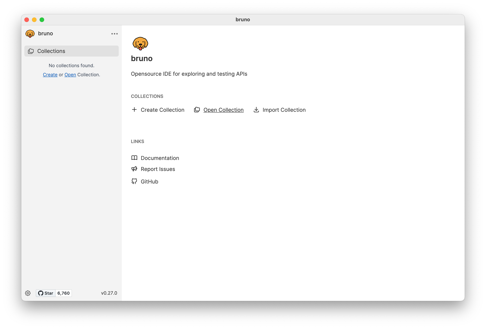
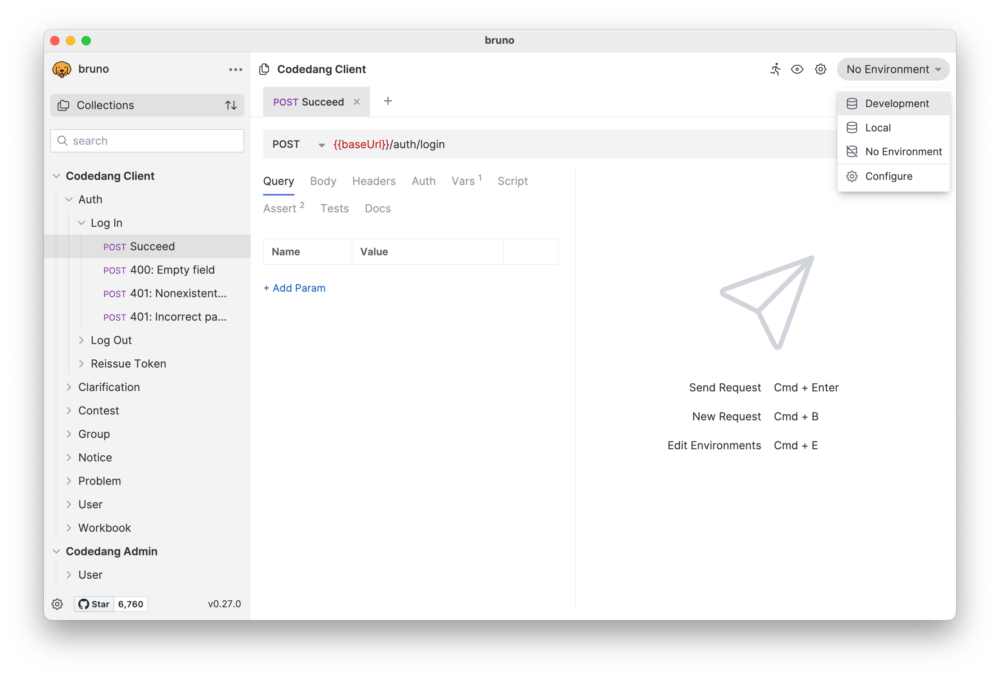
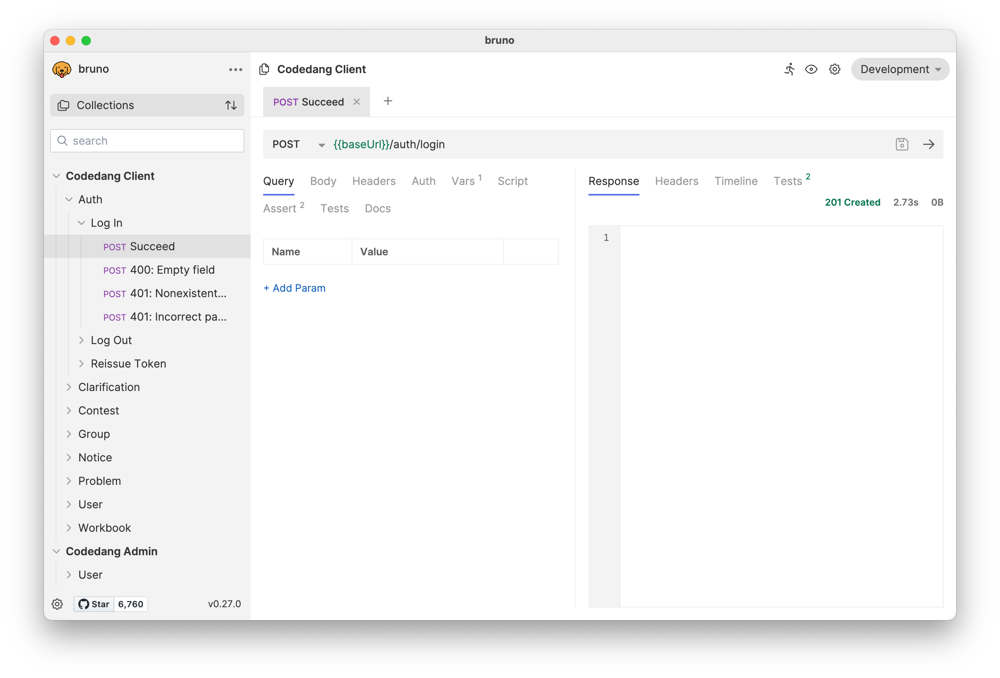
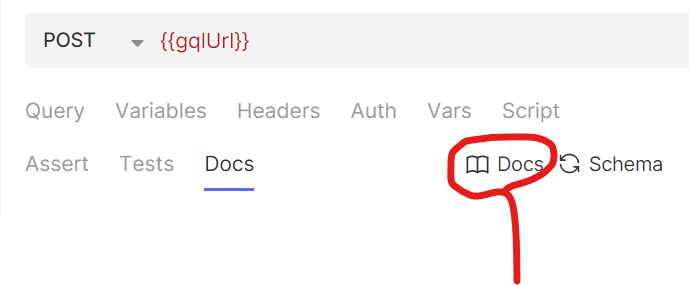

# API Documentation

이 프로젝트에서는 API 문서화 도구로 Bruno를 사용하고 있습니다. Bruno는 Postman, Insomnia와 같이 API를 테스트하고 문서화하는 오픈 소스 도구입니다.

자세한 내용은 공식 홈페이지에서 확인할 수 있습니다.  
https://www.usebruno.com/


## How to use

Bruno로 Codedang API collection을 보려면 아래 단계를 따르세요.

### 1. Bruno 설치

Bruno 홈페이지에서 설치 파일을 다운로드 받아 설치하세요.  
https://www.usebruno.com/downloads

### 2. Collection 불러오기

Bruno를 실행하고 'Open Collection'을 클릭합니다.
Codedang 폴더에서 collection 폴더의 client 또는 admin을 선택합니다.

> [!WARNING]
> 로컬에 코드당을 git clone 해두지 않았다면 Bruno를 사용할 수 없어요.
> Gitpod이나 Codespace를 사용 중인 분들은 따로 git clone 후 진행해주세요!



### 3. 환경 변수 설정

오른쪽 맨 위의 'No Environment'를 클릭하고, 환경을 변경합니다.

- Development: 개발 서버 (https://dev.codedang.com)
- Local: 로컬 서버 (http://localhost)



### 4. 확인

왼쪽 탭에서 request를 선택하여 실행할 수 있습니다. `baseUrl`이 초록색으로 표시되는지 확인해주세요.



## Convention 🤙

새로운 API request를 작성할 때 아래 사항을 지켜주세요.

- 모든 예외 경우마다 request를 작성해주세요. (200, 403, 404 등)
- 설명문은 평어체로 작성해주세요. (~ 한다 등)

### Structure

APP 구분 / 모듈 이름 / 기능 / request 이름  
(예: Codedang Admin / Notice / Create Notice / Succeed)

#### request 이름

각 request는 다음과 같이 이름 지어주세요.

- 성공하는 경우
  - **"Succeed"**
  - **"Succeed: \<description>"**: 성공하는 경우 + 추가 설명 (예: "Succeed: Admin Login")
- 실패하는 경우
  - REST API
    - **"40x: \<description>"**: 400, 401, 403, 404 등의 오류가 발생하는 경우 + 추가 설명 (예: "40x: Invalid email")
  - GraphQL
    - **"<ERROR_CODE>"**: GraphQL Error Code
    - **"<ERROR_CODE>(1)"**: 동일한 Error Code가 발생하는 case가 여러 개인 경우

### Docs

Endpoint마다 'Succeed' request의 'Docs' 탭에 아래 Format을 준수하여 설명을 남겨주세요.

#### Format

```markdown
## API 제목

API가 수행하는 역할을 기재합니다.

### Args / Query / Params / Body

필요한 경우, Args/Query/Params/Body에 대한 설명을 표로 정리합니다.
이름, 타입, 의미, 기본값, 제약사항을 포함해야 합니다.
(예)
| 이름 | 타입 | 설명 |
|--|--|--|
|take|Int|한번에 가져올 데이터의 수, 기본값은 10.|
|groupId|Int|포함하지 않으면 Open Space에 대한 요청이 된다. 기본값은 1.|
|problemId|Int|problemId와 contestId중 하나는 반드시 포함한다.|
|contestId|Int|problemId와 contestId중 하나는 반드시 포함한다.|

### Error Case

API를 호출했을 때 발생 가능한 Error Case의 이름과 설명을 기재합니다.
Error case의 이름은 실패하는 파일의 이름과 일치시켜주세요.
이름은 '#' 4개, 설명은 줄글로 작성합니다.
(예)

#### BAD_USER_INPUT(1)

password가 조건에 맞지 않는 경우.
```

### Scripts

로그인 및 권한이 필요한 request의 경우, Pre Request에서 사전 인증 작업을 수행해주세요. GraphQL의 경우, Admin 계정으로 로그인하는 작업이 전역으로 적용되어 있습니다.

~~Request를 보낼 때 상황별로 결과가 달라지지 않게 해주세요. 다시 말해 **언제나 동일한 결과**가 오게 해주세요.~~

### Assert

모든 request마다 test를 충분히 작성해주세요(상태 코드 검사, body 검사 등). PR이 merge될 때마다 자동으로 E2E 검사가 이뤄집니다.

다음 항목을 포함해야 합니다.

#### REST API

- 성공하는 경우
  - res.status
  - res.body의 모든 property
- 실패하는 경우
  - res.status
  - res.message

#### GraphQL

- 성공하는 경우
  - res.body.data[0] 존재 유무
- 실패하는 경우
  - res.body.errors[0].extensions.code
  - res.body.errors[0].message

### GraphQL


GraphQL 서버 개발 시, field 타입을 정확하게 지정하여 Docs panel만으로 필드 및 반환 객체의 이름과 타입 정보를 알 수 있게 해 주세요.

Query나 Mutation에 인자가 들어가는 경우, `Variables` 항목에 분리하여 작성해주세요.
