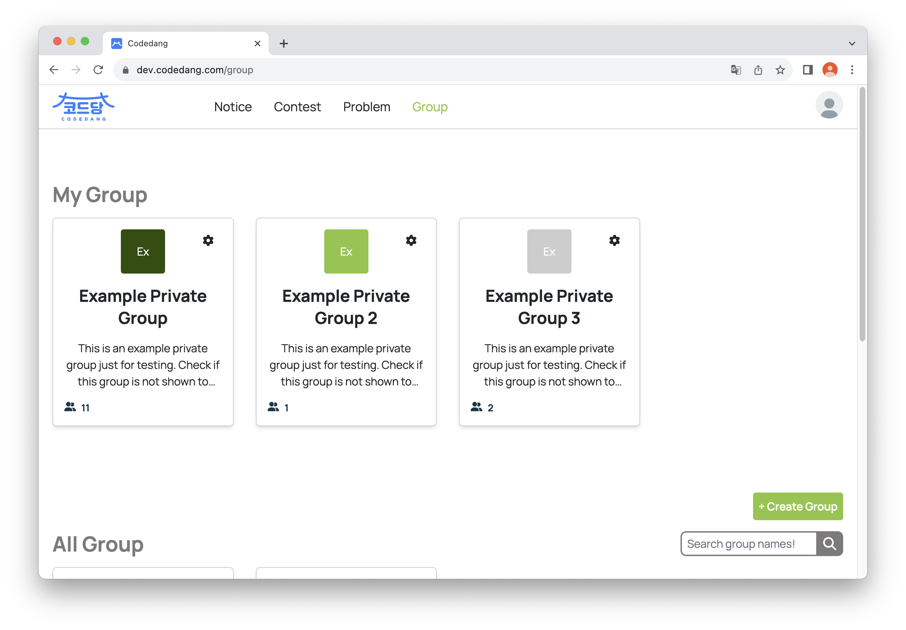
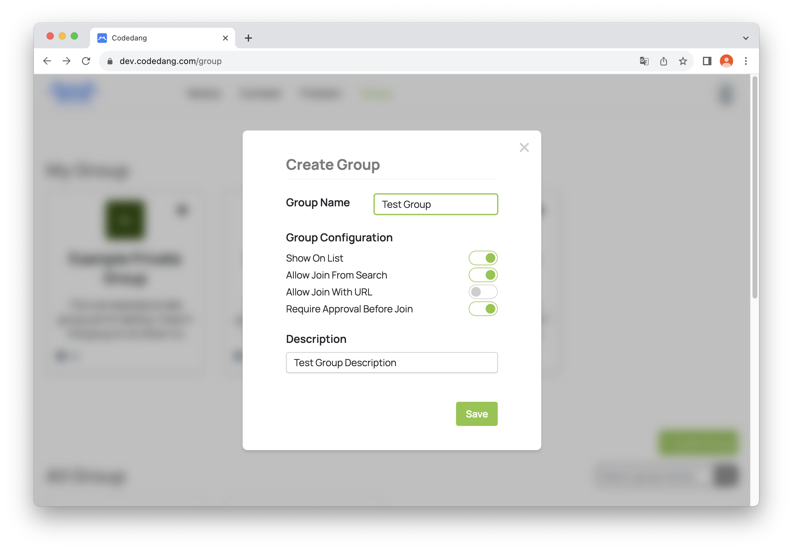
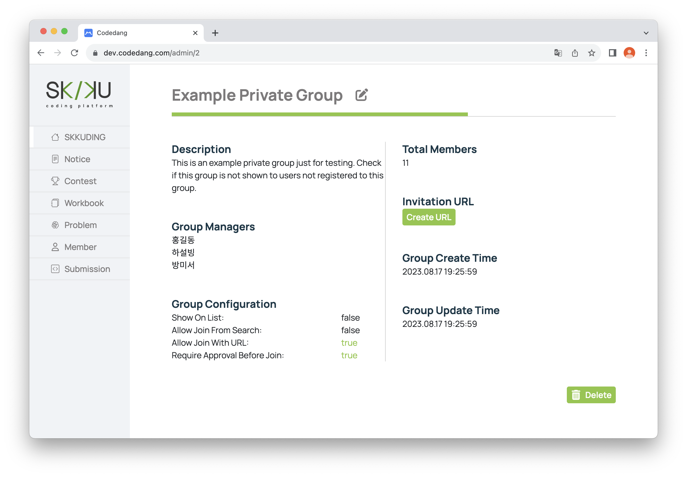
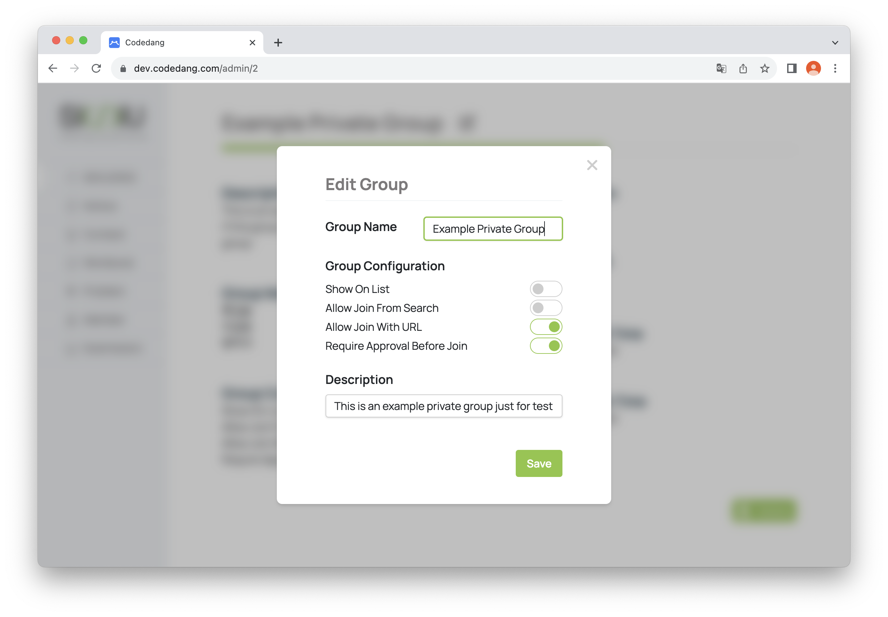
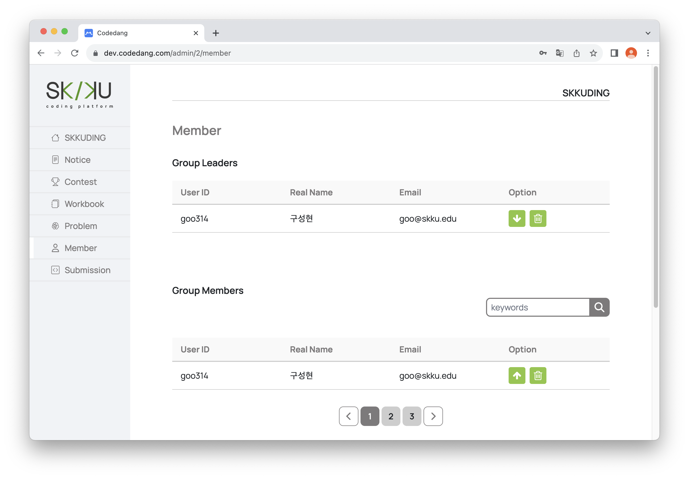
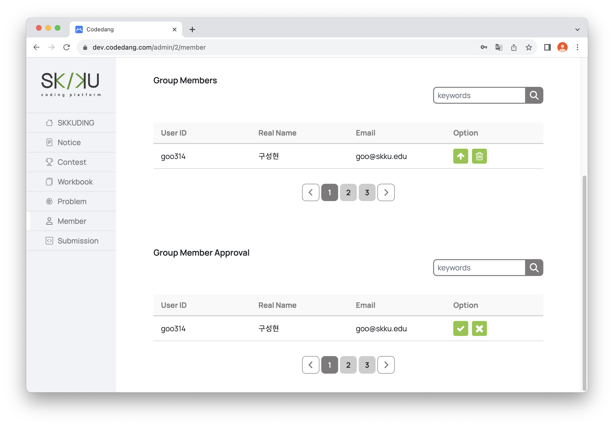

# 그룹 및 멤버 관리

본 Section에서는 그룹 및 멤버 관리 기능에 대해서 소개합니다.

::: warning Group 내의 계층 관련 ⛔️
Group 내에서는 두 가지의 계층이 존재합니다.

- **GroupLeader** : 그룹의 관리자 역할으로, Group 및 Member 관리에 관한 권한들을 갖고 있습니다.
- **GroupMember** : 그룹 내의 일반적인 Member 역할입니다.

본 Section의 독자는 GroupLeader로 가정합니다.
:::

## 그룹 관리

### 새로운 그룹 생성

Manager 이상 계층의 관리자는 직접 그룹을 생성할 수 있습니다.

Group 페이지에서 <code>+Create Group</code> 버튼을 클릭하면 그룹 생성창으로 넘어갑니다.

원하는 Group Name, Group Configuration, Group Description을 작성하고 Save를 클릭하면 그룹이 생성됩니다. 이때, 그룹을 생성한 관리자는 자동으로 해당 그룹의 GroupLeader로 설정됩니다.

Group Configuration의 자세한 설명은 아래와 같습니다.

- **Show On List** :
  자신의 그룹의 전체 공개(All Groups에 표시) 여부를 결정합니다.
- **Allow Join From Search** : 그룹 목록에서 해당 그룹을 선택한 사용자들에게 그룹 가입 버튼의 공개 여부를 결정합니다.
- **Allow Join With URL** : 그룹 가입용 URL 발급 가능 여부를 결정합니다. (⚠️ Allow Join From Search와 Allow Join With URL이 모두 <code>False</code>라면 경고창을 반환합니다.)
- **Require Approval Before Join** : 가입 승인 절차의 유무를 결정합니다. <code>False</code>라면 승인 절차없이 즉시 가입이 완료됩니다.

### 기존 그룹 관리

관리자들은 상단 Header 중 Group을 눌러 자신이 속한 그룹들을 확인할 수 있습니다.

이때, 자신이 GroupLeader로 속한 그룹은 그룹명 우측 상단에 톱니바퀴(⚙️) 모양의 아이콘이 뜨게 됩니다.

톱니바퀴 아이콘(⚙️)을 클릭시 관리자용 그룹 창으로 이동하게 됩니다.

관리자는 그룹 창에서 (1) 그룹 세부설정 수정 (2) 초대 URL 생성 (3) 그룹 삭제를 할 수 있습니다.

- **그룹 세부설정 수정**

  관리자는 그룹명 옆의 연필 아이콘(📝)을 클릭해 그룹 세부 설정을 수정할 수 있습니다.
  
  Group Name, Group Configuration, Description을 수정할 수 있습니다.

- **초대 URL 생성**

  <code>Create URL</code> 버튼을 클릭하여 학생들이 클릭시 해당 그룹에 가입할 수 있는 일회용 초대 URL을 생성할 수 있습니다.

- **그룹 삭제**

  Admin, SuperAdmin 계층의 관리자는 바로 그룹을 삭제할 수 있으며, 이외의 관리자는 자신이 생성한 그룹에 한해서 삭제할 수 있습니다.

## 멤버 관리

관리자는 관리자용 그룹창에서 Member 탭을 통해 관리자용 멤버창으로 접속할 수 있습니다.

관리자용 멤버창에서 사용할 수 있는 기능들은 아래와 같습니다.

### 그룹 내의 계층 변경

관리자는 멤버들의 그룹 내 계층을 변경할 수 있습니다.

계층 변경은 두 가지의 경우가 존재합니다.

- **GroupLeader에서 GroupMember로 downgrade**

  Member 탭의 GroupLeaders 목록에서 ⬇ 버튼을 클릭하면 해당 멤버의 계층을 GroupMember로 downgrade할 수 있습니다.

  > 이때, 모든 GroupLeader를 GroupMember로 downgrade할 수 없습니다.(최소 한 명의 GroupLeader가 존재해야 합니다.)
  > 또한 Admin 및 SuperAdmin 계층의 사용자는 downgrade할 수 없습니다.

- **GroupMember에서 GroupLeader로 upgrade**

  Member 탭의 GroupMembers 목록에서 ⬆ 버튼을 클릭하면 해당 멤버의 계층을 GroupLeader로 upgrade할 수 있습니다.

### 그룹 멤버 강제 탈퇴

관리자는 GroupLeaders 및 GroupMembers 목록에서 🗑️ 버튼을 눌러 멤버를 강제 탈퇴시킬 수 있습니다.

### 그룹 가입 승인 및 거절

관리자는 Group Member Approval 목록에서 대기중인 그룹 가입신청 내역들을 확인할 수 있으며, 승인(✅) 혹은 거절(❎)을 선택할 수 있습니다.
