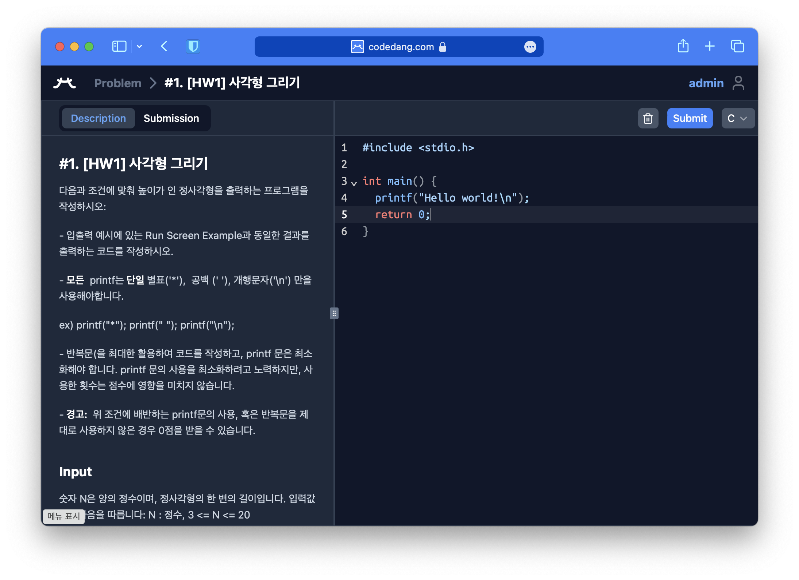

# 코드당이 뭔가요?

코드당은 성균관대학교 Online Judge입니다.
학우들이 프로그래밍 연습 문제를 풀고, 프로그래밍 대회를 준비하며 실력을 키울 수 있는 플랫폼이에요.
소프트웨어융합대학 알고리즘 동아리인 NPC에서 2020년 처음 시작하여, 2022년에 스꾸딩 팀으로 개발 팀이 분리되어 지금까지 개발을 맡고 있어요.

코드당의 목표는 성균관대 학우들의 코딩 학습을 돕는 것이에요.
교수님들과 조교님들이 문제와 대회를 만들고, 학우들이 그 문제를 풀어보며 실력을 키울 수 있도록 돕는 것이 목표입니다.
또한 우리 대학에 맞는 기능을 스꾸딩 팀에서 추가하고 커스터마이징하여, 학우들이 더 편리하게 사용할 수 있도록 노력하고 있어요.

코드당은 시스템을 구성하는 대부분을 오픈 소스로 공개하고 있어요.
스꾸딩 팀 뿐만 아니라 누구나 수정하고 싶은 기능을 건의하고, 심지어 직접 구현할 수 있습니다.
자세한 내용은 [GitHub에서 확인해보세요.](https://github.com/skkuding) (이슈 & PR은 언제나 환영이에요!)

